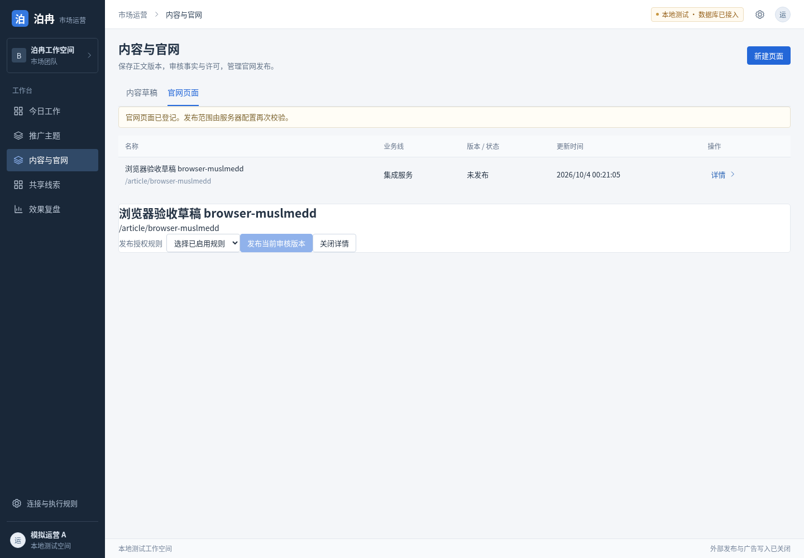
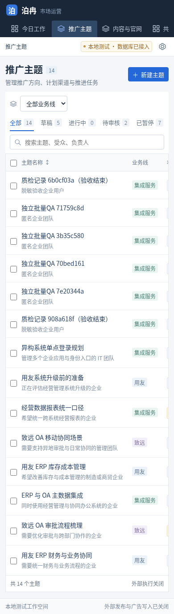

# 实际 Next 页面与 API 独立验收

2026-10-03 16:21 UTC，Chromium、共享 PostgreSQL，运营端 `http://localhost:3000`、公开站 `http://localhost:3001`，development/mock。浏览器最终 9/9 通过；完整机器结果见 [browser-results.json](ui-evidence/browser-results.json)。未连接真实投放、真实爱番番或生产模型。

| 浏览器检查 | 结果 |
| --- | --- |
| 六个桌面页面 | 今日工作、主题、内容与官网、共享线索、复盘、设置均 200；1440px 页面无文档水平溢出 |
| 主题与任务 | 从已有独立 QA 主题编辑目标，保存后刷新持久保留；推进任务可读取，原生抽屉 Escape 可关闭 |
| 两运营共享 | A 保存主题与处理备注；实际设置按钮切换为 B 并重载身份；B 可看到同一保存结果；再切回 A |
| 内容操作链条 | 浏览器连续保存两个不可变正文版本，审核最新；旧版保持 draft，最新版 approved；登记页面获得实际 page ID；未选授权规则时发布按钮关闭 |
| 公共草稿边界 | 新登记页面未发布，公开站实际 HTTP 404；未授权预览也 404 |
| 共享线索面板 | 留资/有效线索/接待分类可切换；当前 0 条时显示真实空态，不造联系人或有效线索 |
| 复盘 | 可打开指标口径；真实数据视图明确待接入，缺指标保持缺口 |
| 手机布局 | 390px 六页面与主题抽屉无文档溢出；导航一行、局部横向滚动，文字 bounding rect 不越过导航或叠到面包屑；宽表在自身容器滚动 |
| 运行稳定 | 最后一轮 pageerror=[]，requestfailed=[] |

独立 HTTP 脚本 `tests/integration/ops-http.test.ts` 使用 `BORAN_TEST_OPS_URL`、`BORAN_TEST_PUBLIC_URL` 显式启用。最新执行 4/4 个可用检查通过，生产保护项因未提供 `BORAN_TEST_PROTECTED_URL` 跳过。覆盖共享主题、请求幂等与载荷冲突、旧 If-Match 409、B 不能修改 owner 隐私设置、CSRF/Origin/伪造账号阻断、私有接待缺授权阻断、匿名隐私默认关闭、公开事件 canonical/规范别名的同源/schema/大小/未发布来源阻断。所有 QA 主题均暂停，草稿页面保持未发布；没有清理既有工作数据。

验收中修复了移动导航三行挤压，以及 UI 路径示例、环境 prefix 和域规范尾斜杠不一致。内容新增/再保存/审核/page ID 读回的接口差异由根负责人修正后实际操作回归。开发服务器在 HMR 中曾出现一次 hydration mismatch；重启后两轮干净 context 未复现，最后机器记录无异常。

## 优化生产构建最终验收

2026-10-03，停止开发服务器后，以 `Next start`、`APP_ENV=test`、`AUTH_MODE=mock`、`BORAN_MODE=mock` 和共享 PostgreSQL 验收。六个运营页面分别在 1440px 与 390px 检查，12/12 均返回 200，无页面异常、失败的业务 API 或文档水平溢出。新建主题使用实际成员接口的首位负责人，保存后刷新仍可读取。

复盘通过实际数据库 API 读取历史模拟导入，权威活动口径为 220 元、2,200 次曝光、110 次点击、9 次平台转化；真实模式缺数据时四项均显示缺口。站内报告通知读取后保留已读状态。记录见 [生产验收 JSON](ui-evidence/production-verification.json) 与 [收件箱及指标证据](ui-evidence/final-inbox.json)；最终界面见 [报告桌面截图](ui-evidence/final-reports-desktop.png) 和 [报告手机截图](ui-evidence/final-reports-mobile.png)。

首次加载发现的站点图标 404 已修复。两端重新优化构建并重启后，用新浏览器 context 单独回归：页面和有效 ICO 均返回 200，控制台与页面错误均为空。机器记录保留完整页面检查所用构建 ID 与此次最终构建 ID，最终 `passed=true`。Next 路由预取的正常取消单独计数，未当作业务 API 失败。

生产默认身份保护服务在未配置真实 OIDC 时返回 503；公开隐私页返回 200，匿名草稿预览返回 404。实际公网域名、真实身份服务、真实平台回读与真实 PII 生命周期不在本次本地通过范围内。最终截图、JSON 和本文已冻结，未修改产品功能。

